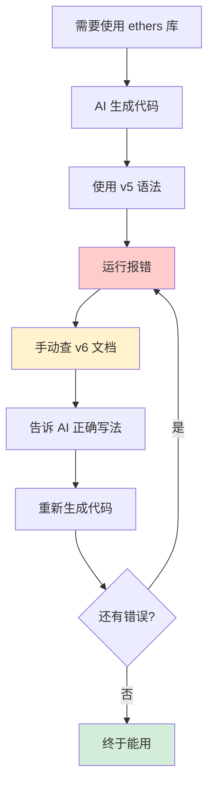
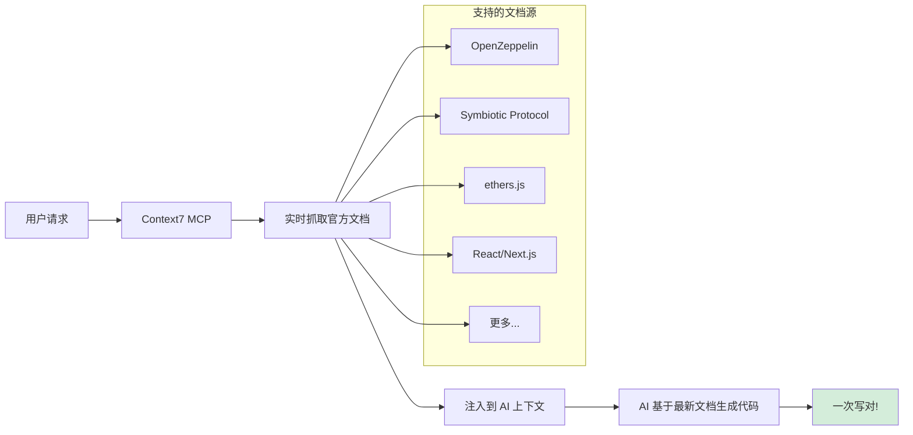
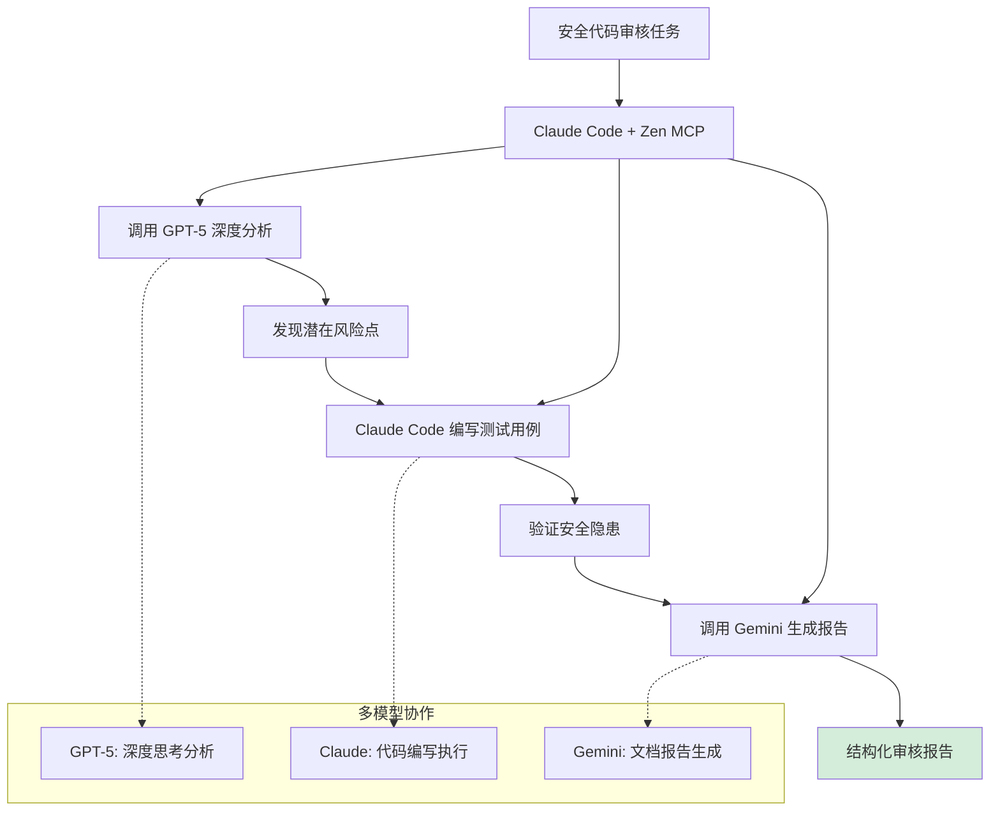
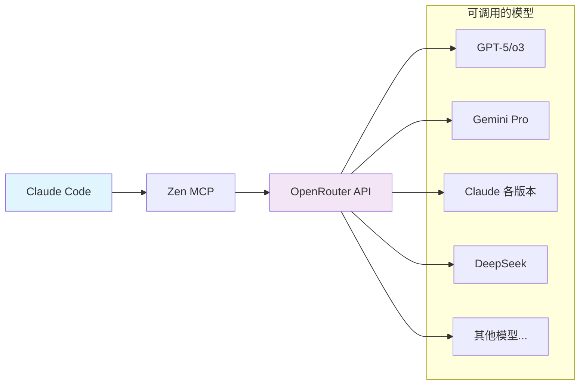

I recently saw some Claude Code MCP discussions on Twitter, which reminded me of two MCP plugins I've been using daily. As a security engineer who reviews code constantly, these tools genuinely solve real pain points in my workflow. Here's my experience with them.

## Pain Point #1: AI-Generated Code Is Always Outdated

I remember writing Ethereum smart contracts with Cursor and needing the ethers library for on-chain interactions. The AI kept generating v5 syntax, but our project was on v6. The ethers library underwent massive API restructuring in v6 -- method names and calling conventions were completely different.



Every single time, it was the same loop: AI generates code, runtime error, manually check docs, teach the AI the correct approach, regenerate. When you need to call dozens of different methods, this cycle is absolutely maddening.

Then I discovered **Context7 MCP** -- a genuine lifesaver.

### Context7: Real-Time Access to Latest Documentation

The core idea is simple but effective: fetch the latest content from official documentation in real time and inject it directly into the AI's context. No more worrying about the AI's "knowledge" being outdated.



**Installation:**
```bash
claude mcp add --transport http context7 https://mcp.context7.com/mcp --header "CONTEXT7_API_KEY: YOUR_API_KEY"
```

**Usage couldn't be simpler:** Just add "use context7" to your prompt.

The documentation coverage is impressive. Beyond mainstream frameworks like React and Next.js, it even covers niche Web3 domains:
- **OpenZeppelin Contracts**: Essential smart contract security library docs for DeFi projects
- **Symbiotic Protocol**: A relatively new shared security protocol -- I was surprised to see it supported
- **Major blockchain SDKs**: Full coverage from ethers to viem

Now my code compiles on the first try. The AI generates accurate code based on the latest APIs, completely eliminating version mismatches.

## Pain Point #2: A Single Model Has Its Limits

During code audits, I often need to uncover potential vulnerabilities. In practice, I've noticed an interesting pattern:
- **Claude Code** is a "workhorse" for coding -- it implements features quickly
- **GPT-5** excels at deep analysis, especially in scenarios requiring logical reasoning

For example, when auditing DeFi contracts:
- GPT-5 can dissect economic models and discover subtle attack vectors
- Claude Code is great at writing test cases to verify those vulnerabilities

Previously, I had to constantly switch between tools, copying and pasting -- terribly inefficient.

### Zen MCP: Multi-Model Orchestration

**Zen MCP** solves this perfectly by letting Claude call on other models' capabilities.



I chose to connect via **OpenRouter** -- one configuration gives you access to multiple models: GPT-5, Gemini, various Claude versions, DeepSeek, and more. You can also configure individual platform APIs separately.

**Typical Workflow:**
1. **Deep analysis**: Call GPT-5 to identify code risk areas
2. **Vulnerability verification**: Claude writes test cases based on the analysis
3. **Report generation**: Use Gemini to produce a structured report

This division of labor lets each model play to its strengths: GPT-5 handles the "thinking," Claude handles the "doing" -- seamlessly connected.

### Installation and Configuration

**Option B: Instant Setup (Recommended)**

Add the following to `~/.claude/settings.json` or `.mcp.json`:

```json
{
  "mcpServers": {
    "zen": {
      "command": "bash",
      "args": ["-c", "for p in $(which uvx 2>/dev/null) $HOME/.local/bin/uvx /opt/homebrew/bin/uvx /usr/local/bin/uvx uvx; do [ -x \"$p\" ] && exec \"$p\" --from git+https://github.com/BeehiveInnovations/zen-mcp-server.git zen-mcp-server; done; echo 'uvx not found' >&2; exit 1"],
      "env": {
        "PATH": "/usr/local/bin:/usr/bin:/bin:/opt/homebrew/bin:~/.local/bin",
        "OPENROUTER_API_KEY": "your-key-here",
        "DISABLED_TOOLS": "analyze,refactor,testgen,secaudit,docgen,tracer",
        "DEFAULT_MODEL": "auto"
      }
    }
  }
}
```

Once configured, you can flexibly invoke various models from within Claude. It supports both OpenRouter API and individually configured platform API keys.



## Practical Tips

### Context7 Tips:
- **API key is optional**: It works without one, but having a key increases your rate limits
- **Use the topic parameter wisely**: Specify the documentation scope when focusing on a particular feature
- **Retry on network issues**: Failed doc fetches are usually caused by transient network hiccups

### Zen MCP Tips:
- **Don't overuse it**: For simple tasks, just use Claude directly
- **Define clear roles**: Analysis with GPT-5, coding with Claude
- **Manage costs**: Choose models on OpenRouter based on task importance

## Before and After

| Scenario          | Before                          | After                           |
|-------------------|---------------------------------|---------------------------------|
| API doc lookup    | Manual search, teach AI, retry  | "use context7" and it just works |
| Code auditing     | Switching between tools         | Analysis, coding, and reporting in one flow |
| Learning new tech | Risk of learning outdated patterns | Real-time access to best practices |
| Dev efficiency    | Constant debugging and rework   | Significantly less rework       |

## Conclusion

These two MCPs tackle core pain points head-on:
- **Context7** permanently solves the stale documentation problem
- **Zen MCP** breaks through single-model limitations

For developers working with complex tech stacks, these tools are genuine productivity multipliers. No flashy gimmicks -- just solid, tangible improvements to the development experience.

If you're using Claude, I strongly recommend giving these two MCPs a try. You'll wonder how you ever managed without them.

---

**Resources:**
- [Context7 GitHub](https://github.com/upstash/context7)
- [Zen MCP GitHub](https://github.com/BeehiveInnovations/zen-mcp-server)
- [Claude Code MCP Documentation](https://docs.anthropic.com/en/docs/claude-code/mcp)
