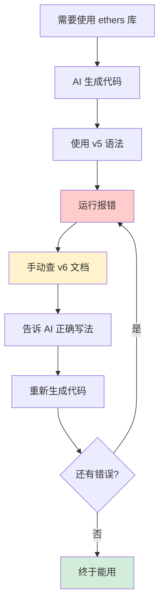
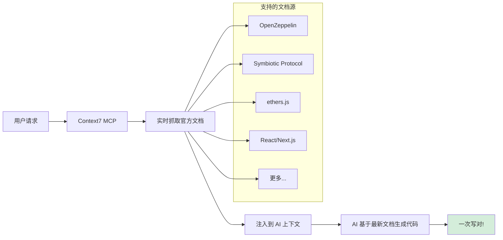
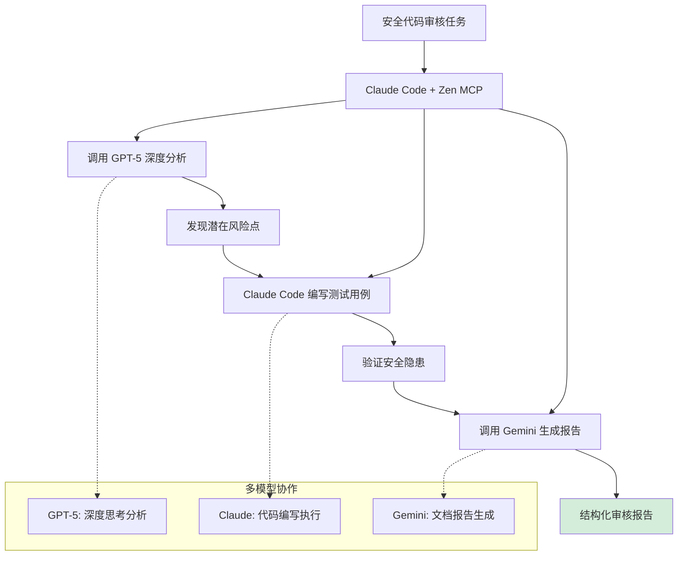
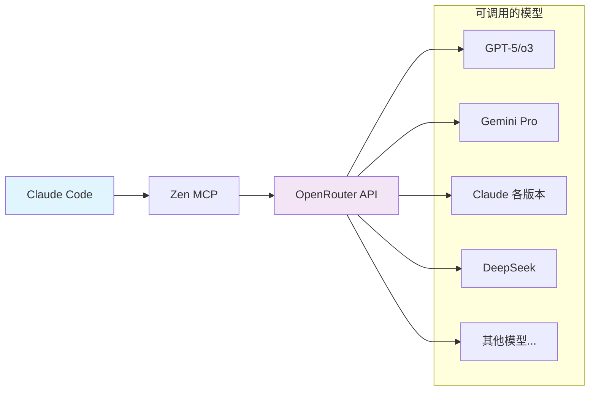

最近在 Twitter 看到 Claude Code MCP 的讨论，让我想起正在使用的两个 MCP 插件。作为需要频繁审计代码的安全工程师，这两个工具确实解决了实际工作中的痛点，分享下使用体验。

## 痛点一：AI 生成的代码总是过时

记得用 Cursor 写以太坊合约时，需要用到 ethers 库处理链上交互。但 AI 生成的代码全是 v5 语法，而项目用的是 v6 版本。ethers 在 v6 做了大量 API 重构，方法名和调用方式全变了。



每次都要经历这样的循环：AI 生成代码 → 运行报错 → 手动查文档 → 教 AI 正确写法 → 重新生成。当需要频繁调用不同方法时，这个过程简直让人抓狂。

直到遇到 **Context7 MCP** 这个救星。

### Context7：实时获取最新文档

核心思路简单却高效：实时抓取官方文档最新内容，直接注入 AI 上下文。从此不再担心 AI 的"知识"过期。



**安装命令：**
```bash
claude mcp add --transport http context7 https://mcp.context7.com/mcp --header "CONTEXT7_API_KEY: YOUR_API_KEY"
```

**使用更简单：** 在 prompt 里加一句 "use context7" 即可。

让人惊喜的是文档覆盖范围：除了 React/Next.js 等主流框架，连 Web3 细分领域都包含：
- **OpenZeppelin Contracts**：DeFi 项目必备的智能合约安全库文档
- **Symbiotic Protocol**：较新的共享安全协议，没想到也能支持
- **主流区块链 SDK**：从 ethers 到 viem 全面覆盖

现在写相关代码基本一次通过，AI 能根据最新 API 生成准确代码，彻底告别版本错配。

## 痛点二：单一模型能力有限

代码审计时常需要发现潜在漏洞，实践中发现个有趣现象：
- **Claude Code** 写代码很"勤快"，能快速实现需求
- **GPT-5** 更擅长深度分析，尤其在需要逻辑推演的场景

例如审计 DeFi 合约时：
- GPT-5 能剖析经济模型，发现隐蔽攻击向量
- Claude Code 则擅长编写验证漏洞的测试用例

过去不得不在不同工具间来回切换，复制粘贴效率极低。

### Zen MCP：多模型协同作战

**Zen MCP** 完美解决这个问题，让 Claude 能调用其他模型能力。



我选择接入 **OpenRouter**，一次配置即可调用多模型：GPT-5、Gemini、各版本 Claude、DeepSeek 等。当然也支持单独配置各平台 API。

**典型工作流：**
1. **深度分析**：调用 GPT-5 识别代码风险点
2. **漏洞验证**：Claude 根据分析编写测试用例
3. **报告生成**：用 Gemini 输出结构化报告

这种分工让各模型发挥所长：GPT-5 负责"思考"，Claude 负责"执行"，无缝衔接。

### 安装配置

**Option B: 即时设置（推荐）**

在 `~/.claude/settings.json` 或 `.mcp.json` 中添加以下配置：

```json
{
  "mcpServers": {
    "zen": {
      "command": "bash",
      "args": ["-c", "for p in $(which uvx 2>/dev/null) $HOME/.local/bin/uvx /opt/homebrew/bin/uvx /usr/local/bin/uvx uvx; do [ -x \"$p\" ] && exec \"$p\" --from git+https://github.com/BeehiveInnovations/zen-mcp-server.git zen-mcp-server; done; echo 'uvx not found' >&2; exit 1"],
      "env": {
        "PATH": "/usr/local/bin:/usr/bin:/bin:/opt/homebrew/bin:~/.local/bin",
        "OPENROUTER_API_KEY": "your-key-here",
        "DISABLED_TOOLS": "analyze,refactor,testgen,secaudit,docgen,tracer",
        "DEFAULT_MODEL": "auto"
      }
    }
  }
}
```

配置完成后，就能在 Claude 中灵活调用各类模型。支持 OpenRouter API 或单独配置各平台 API Key。



## 实践建议

### Context7 技巧：
- **API Key 非必须**：不配置也能用，但有 Key 可放宽速率限制
- **善用 topic 参数**：聚焦特定功能时指定文档范围
- **网络问题重试**：文档获取失败多因临时网络波动

### Zen MCP 心得：
- **避免滥用**：简单任务直接用 Claude 即可
- **明确分工**：分析用 GPT-5，编码用 Claude
- **成本控制**：按任务重要性选择 OpenRouter 上的模型

## 效果对比

| 场景         | 使用前                     | 使用后                     |
|--------------|----------------------------|----------------------------|
| API 文档查询  | 手动查文档→教 AI→重试       | "use context7"→一次成功    |
| 代码审计     | 多工具切换                 | 分析→编码→报告全流程闭环   |
| 学习新技术   | 可能学到过时方案           | 实时获取最佳实践           |
| 开发效率     | 反复调试修改               | 显著减少返工               |

## 总结

这两个 MCP 直击核心痛点：
- **Context7** 根治文档过期问题
- **Zen MCP** 打破单模型能力局限

对于处理复杂技术栈的开发者，这俩工具堪称效率神器。它们没有花哨噱头，却实实在在地提升了开发体验。

如果你也在用 Claude，强烈建议试试这两个 MCP，相信你会拍腿感叹："怎么没早点用！"

---

**相关资源：**
- [Context7 GitHub](https://github.com/upstash/context7)
- [Zen MCP GitHub](https://github.com/BeehiveInnovations/zen-mcp-server)
- [Claude Code MCP 文档](https://docs.anthropic.com/en/docs/claude-code/mcp)