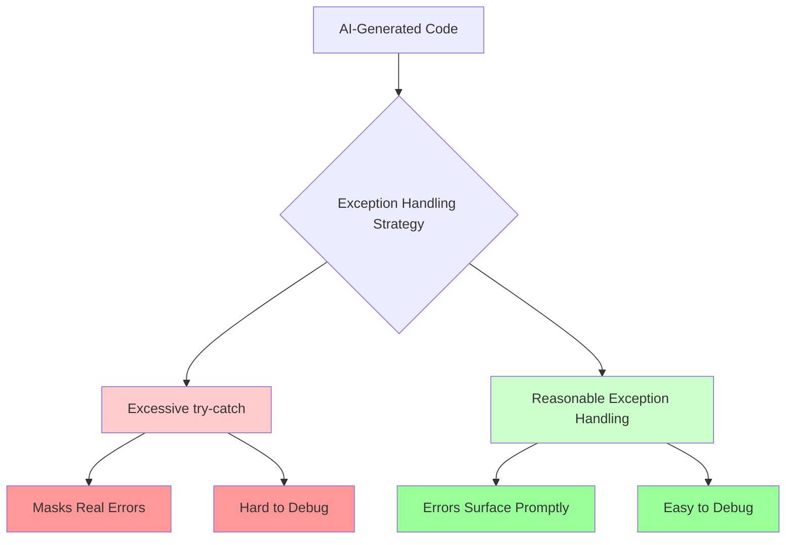
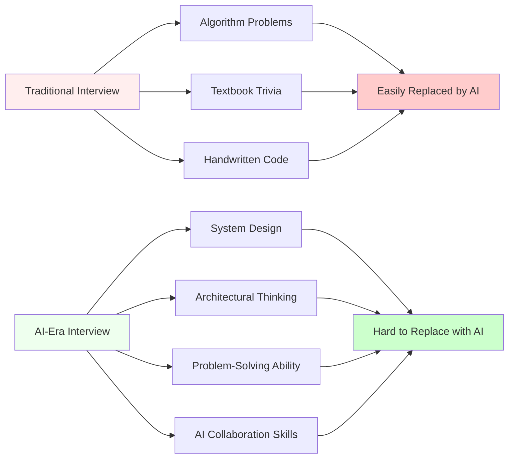
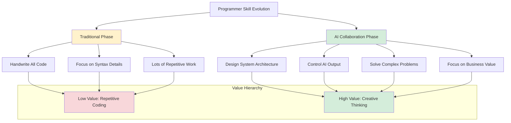

I was chatting with a few friends recently, and we all shared the same feeling: the act of writing code has fundamentally changed.

From GitHub Copilot to Cursor to the Claude Code I'm using now, I've watched AI coding tools evolve at a breakneck pace. Honestly, I was a bit resistant at first -- I kept thinking these tools would make me "lazy." But after using them for a while, I realized the issue isn't the tools themselves. It's about how we redefine our own value.

## Micro-Level Gains, Macro-Level Concerns

As a security engineer, I review large volumes of code every day. The most obvious change over the past couple of years? **Code quality at the micro level has become much more consistent.**

I used to see all kinds of sloppy practices: variable names chosen on a whim, inconsistent indentation, exception handling skipped wherever possible. Those basic issues are far less common now -- AI is genuinely good at enforcing code conventions.

But new problems have emerged. The most typical one is **overly defensive programming**. I've seen plenty of AI-generated code that wraps everything in try-catch blocks, catching every conceivable exception. On the surface it looks "safe," but in reality it buries the errors that actually matter.

Once, while debugging a production issue, I spent most of a day before discovering that a database connection failure had been silently swallowed. The error logs looked perfectly calm, while the business logic had gone completely off the rails. That kind of "thoughtful" exception handling is a debugging nightmare.

What's even more concerning is the **explosion in code production speed**. What used to take a week to develop can now be done in half a day. Sounds great, right? The problem is that review can't keep up. Human cognitive bandwidth hasn't increased just because AI arrived -- yet we're expected to digest far more code in far less time.

## New Rules for the Interview Game

Speaking of changes, the most interesting shift is in hiring.

Many companies are struggling with a question: how do you prevent candidates from "cheating" with AI during remote interviews? Some require dual-camera monitoring, others have scrapped online interviews entirely. It's exhausting for everyone involved.

I think the premise is wrong. **Instead of trying to ban AI, just tell candidates: you can use any AI tool you want.**

Being able to use AI effectively is a skill in itself -- why fight it? The key is to change what you're evaluating. Traditional algorithm puzzles and textbook trivia are easy for AI to "crack." But if you ask a candidate to design a system architecture on the spot, or explain why they'd handle a specific business scenario a certain way -- how much can AI really help with that?

This raises the bar for interviewers too. You can't just memorize a few algorithm problems and call yourself qualified to interview. You need to genuinely understand the business, the architecture, and engineering practices to design questions with real differentiation.

## From Code Worker to AI Commander

So in the midst of all this change, what are a programmer's actual core skills?

My answer: **shift your focus from code details to learning how to direct AI.**

Think of AI as a highly capable programming assistant you've hired. It's talented, but it needs clear instructions and ongoing guidance. Your value is no longer in writing every line of code yourself -- it's in:

### 1. Architectural Thinking

The work that used to be reserved for architects now needs to be understood by every engineer. You need to decompose complex business requirements into clean modules, design sensible interfaces, and plan extensible structures. AI can implement the details, but the architectural blueprint is still yours to draw.

### 2. Requirements Understanding and Translation

AI struggles with the subtext behind business requirements. When a client says "I need a user management feature," what specific scenarios does that cover? What are the edge cases? What security considerations are involved? A human has to sort through all of that and translate it into something actionable.

### 3. Quality Control and Risk Identification

As I mentioned with the exception handling example, someone needs to review AI-generated code. Where are the potential pitfalls? Could there be performance issues? Are the security boundaries clear? This kind of judgment is something AI can't replace.

### 4. Engineering Practices

How should CI/CD be designed? What's the testing strategy? How should code be organized? How do you optimize the deployment pipeline? These core software engineering skills haven't diminished in importance -- if anything, they've become more critical than ever.

## AI Is a Stepping Stone, Not a Replacement

A lot of people worry that AI will make programmers obsolete. I don't think that concern holds up.

Every major technological shift in history has triggered similar fears. From assembly to high-level languages, from command lines to IDEs, from manual deployments to automated operations -- every time, someone predicted the end of programmers. What actually happened? The software industry kept booming, and demand for developers kept growing.

AI coding tools are fundamentally a **productivity upgrade**. They free us from low-value repetitive work and give us the opportunity to focus on more creative, more challenging problems.

When you no longer need to spend hours writing CRUD code, you finally have the bandwidth to think about system design, user experience, and business value. Isn't that an upgrade for the profession?

## Implications for Companies

Organizations need to adjust their hiring and talent development strategies too:

1. **Update interview criteria**: Stop testing whether candidates can hand-write quicksort. Evaluate whether they can design a sound system architecture.

2. **Value soft skills**: Communication, requirements comprehension, and cross-team collaboration are more important than ever in the AI era.

3. **Invest in training**: Help existing employees learn how to use AI tools effectively, rather than fearing them.

4. **Calibrate expectations**: Don't assume AI means infinite development speed. Quality assurance still takes time.

## Final Thoughts

In the AI coding era, the programmer's value hasn't depreciated -- it's being redefined.

We're evolving from "code producers" to "software product architects," from "feature implementers" to "problem solvers." This transition requires proactive learning and active adaptation, but it also presents unprecedented opportunities.

Embrace the change. In this era, the biggest risk isn't being replaced by AI -- it's refusing to learn how to work alongside it.

After all, the people who truly know how to harness AI are the ones who'll be writing the next chapter.

---

*How are you using AI coding tools in your work? Got any interesting experiences or reflections? I'd love to hear from you in the comments!*
