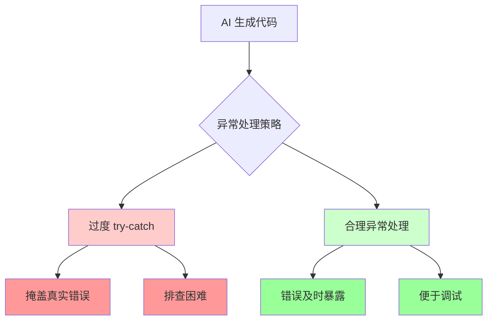
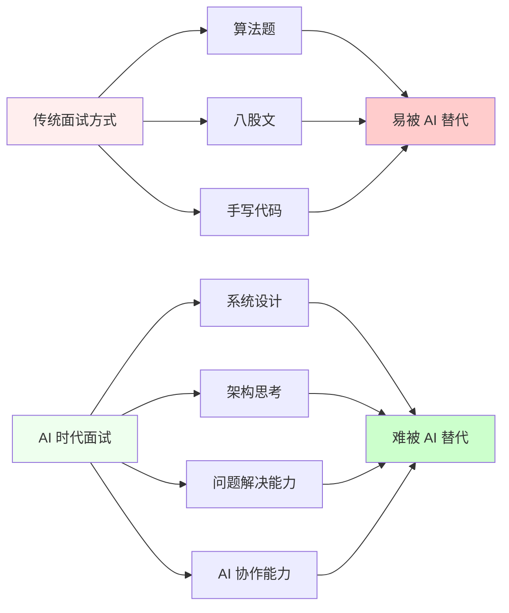
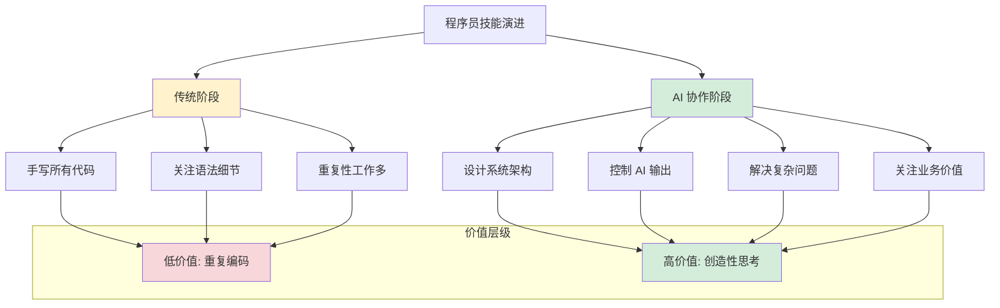

最近和几个朋友聊天，大家都有个共同感受：写代码这件事，真的变了。

从 GitHub Copilot 到 Cursor，再到现在手头的 Claude Code，我算是见证了 AI 编码工具的快速迭代。说实话，刚开始还有点抗拒，总觉得这些工具会让自己变"懒"。但用久了才发现，问题不在于工具本身，而在于我们如何重新定义自己的价值。

## 微观提升，宏观隐忧

作为安全工程师，我每天都要审查大量代码。这两年最明显的变化是什么？**代码的微观质量变得更一致了**。

以前经常能看到各种不规范的写法：变量命名随心所欲、缩进格式五花八门、异常处理能省则省。现在这些基础问题少了很多，AI 在代码规范性上确实做得不错。

但新问题也随之而来。最典型的就是**过度防御性编程**。我见过不少 AI 生成的代码，动不动就来个 try-catch，把所有可能的异常都捕获了。表面上看很"安全"，实际上却把真正严重的错误给掩盖了。

有次排查一个线上问题，花了大半天才发现是数据库连接异常被静默处理了，错误日志里一片祥和，结果业务逻辑完全跑偏了。这种"贴心"的异常处理，对于排查问题简直是噩梦。

更要命的是，**代码生产速度的暴增**。原来一周的开发量，现在半天就能搞定。听起来很棒？问题是审查跟不上了。人的认知带宽没有因为 AI 而提升，反而要在更短时间内消化更多代码。

## 面试游戏的新规则

说到变化，最有意思的是面试环节。

现在很多公司都在纠结：线上面试怎么防止候选人用 AI "作弊"？有的要求双机位监控，有的干脆取消线上面试，搞得面试双方都很累。

我觉得这个思路本身就错了。**与其防范 AI，不如直接告诉候选人：你可以用任何 AI 工具。**

能用好 AI 本身就是一种能力体现，为什么要排斥呢？关键是考查方式要变。传统的算法题和八股文确实容易被 AI "破解"，但如果你让候选人现场设计一个系统架构，或者解释为什么要这样处理某个业务逻辑，AI 能帮多少忙？

这对面试官的要求更高了。不能再像以前那样，背几道算法题就能当面试官。你得真正理解业务、理解架构、理解工程实践，才能设计出有区分度的问题。

## 从代码工人到 AI 指挥官

那么，在这个变化中，程序员的核心能力到底是什么？

我的答案是：**从关注代码细节，转向学会控制 AI**。

想象一下，AI 就像你花钱雇的一个编程助手。能力很强，但需要明确的指令和持续的引导。你的价值不再是亲自写每一行代码，而是：

### 1. 架构思维能力

以前架构师做的事，现在普通工程师也要会。你需要把复杂的业务需求拆解成清晰的模块，设计合理的接口，规划可扩展的结构。AI 可以帮你实现细节，但架构蓝图还得你来画。

### 2. 需求理解和转化能力

AI 很难理解业务的潜台词。客户说"要一个用户管理功能"，具体包含哪些场景？有什么边界条件？需要考虑哪些安全因素？这些都需要人来梳理和翻译。

### 3. 质量控制和风险识别

就像我前面提到的异常处理问题，AI 生成的代码需要有人来把关。哪些地方可能有坑？性能会不会有问题？安全边界是否清晰？这些判断力是 AI 替代不了的。

### 4. 工程化实践能力

CI/CD 怎么设计？测试策略如何制定？代码怎么组织？部署流程如何优化？这些软件工程的核心技能，重要性不但没有降低，反而更加凸显。

## AI 是垫脚石，不是替代者

很多人担心 AI 会淘汰程序员，我觉得这种担心大可不必。

历史上每次技术革新都会有类似的担忧。从汇编到高级语言，从命令行到 IDE，从手工部署到自动化运维，每一次都有人说"程序员要失业了"。结果呢？软件行业越来越繁荣，程序员的需求量越来越大。

AI 编码工具的出现，本质上是**生产力工具的升级**。它释放了我们在低价值重复劳动上的时间，让我们有机会去做更有创造性、更有挑战性的事情。

当你不再需要花大量时间写 CRUD 代码时，你就有精力去思考系统设计、用户体验、商业价值。这难道不是程序员这个职业的升级吗？

## 对企业的启示

对于招聘和人才培养，企业也需要调整策略：

1. **更新面试标准**：不要再考查候选人能不能手写快排，而要看他能不能设计出合理的系统架构。

2. **重视软技能**：沟通能力、需求理解能力、跨部门协作能力，这些在 AI 时代变得更加重要。

3. **投资培训**：帮助现有员工学习如何高效使用 AI 工具，而不是恐惧这些工具。

4. **调整期望**：不要因为有了 AI 就期望开发速度无限提升，质量把关仍然需要时间。

## 写在最后

AI 编码时代，程序员的价值没有贬值，而是在重新定义。

我们从"代码的生产者"变成了"软件产品的架构师"，从"功能的实现者"变成了"问题的解决者"。这个转变需要我们主动学习、积极适应，但也给了我们前所未有的机会。

拥抱变化吧，朋友们。在这个时代，最大的风险不是被 AI 替代，而是拒绝学习如何与 AI 协作。

毕竟，真正能够掌控 AI 的人，才是未来的主角。

---

*你在工作中是如何使用 AI 编码工具的？有什么有趣的经历或思考？欢迎在评论区分享！*