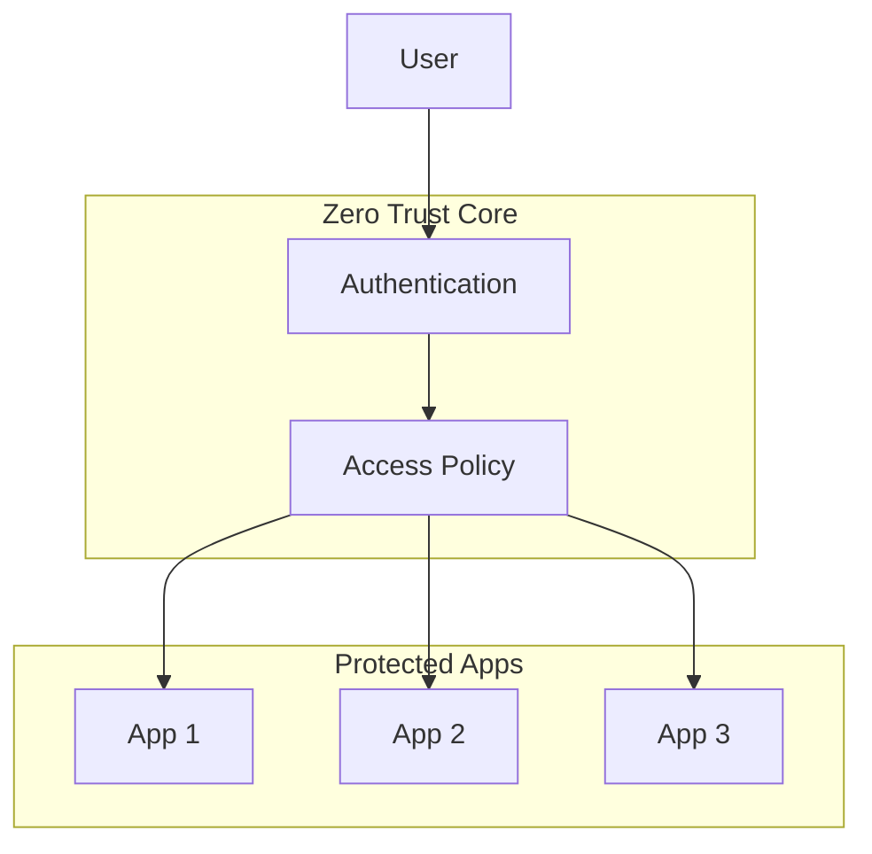

When you say "enterprise network security," VPN is the first thing most people think of. Early in my career, every time I needed to access an internal system, I had to wrestle with that love-hate VPN client first -- nothing worked without it. But a recent audit of an internal app running on Supabase forced me to rethink the fundamentals: in today's world of cloud services everywhere, can the old VPN approach still hold up?

## VPN: The Familiar Security Guard

VPN is a lot like the gate guard at an apartment complex -- enter the right password and you're inside the "secure zone," free to roam as you please. This model worked well enough, especially when everything lived in the company's own data center.

But live with it long enough and the cracks start to show. I remember being on a business trip, eagerly pulling out my iPad to push an urgent fix, only to discover I couldn't install the company VPN on it. I stared at that tantalizing intranet link in my email, tapping furiously on a screen that wouldn't cooperate. And the network experience was brutal: all traffic routed through the VPN server turned video calls into slideshows, with colleagues' lip movements lagging behind their words.

The worst part was the security gap. Last year, a teammate's VPN credentials got stolen. The attacker waltzed through the internal network like they had an all-access pass, helping themselves to data like it was a buffet. Classic "hard shell, soft center" -- the front gate is armored steel, but the backyard fence is held together with wishes.

## Zero Trust: Security Through Systematic Suspicion

Zero Trust sounds fancy, but the core idea is dead simple: **no matter who you are, you prove your identity every time you want access.**

My experience using Akamai EAA at Bybit was an eye-opener. No client software to install -- just type an internal address into the browser, get redirected to a login page, authenticate, and you're in. Smooth as scanning a QR code to log into a mobile app. That's the kind of experience modern workers deserve.

Here's a useful analogy: traditional VPN is like an old apartment complex where getting past the front gate means you can wander anywhere. Zero Trust is like a high-security lab where you badge in and verify your identity at every single door.

## The Real Battlefield: Cloud-Era Security Challenges

The Supabase internal app I audited recently was a perfect case study. The vulnerabilities were everywhere, and when I tried to lock things down with IP whitelisting -- no dice. Cloud services like this simply don't support it. VPN was completely useless here.

This is the reality we're dealing with now:
- SaaS services don't respect IP whitelists
- Employee devices are all over the map (phones, tablets, gaming laptops -- you name it)
- Remote work is the norm, not the exception
- Applications are scattered across AWS, GCP, Alibaba Cloud

This is where Zero Trust shines. No matter which cloud your app lives in, as long as it's behind unified authentication, access control just works. It's like installing a smart access system on every application, with permissions granular down to the individual user.

## The Three Pillars of Zero Trust (In Plain English)

**1. Identity Verification**
Think of it as a digital badge system that confirms who you are. It integrates with existing corporate AD/LDAP or modern identity providers like Azure AD.

**2. Policy Engine**
Picture a security control room with live monitoring. It makes real-time decisions: "Can Zhang access the finance system from a laptop? At 3 AM? Connecting from Thailand?"

**3. Access Gateway**
This is the meticulous guard who checks credentials, matches them against the roster, and logs everything for every single request. Cloudflare Zero Trust and Akamai EAA are essentially productized, out-of-the-box versions of this entire system.

## The Showdown: How Do You Choose?

| Comparison        | Traditional VPN             | Zero Trust                  |
|-------------------|-----------------------------|-----------------------------|
| **Security model** | Trust after entry          | Verify at every step        |
| **User experience** | Install client + traffic detour | Direct browser access, silky smooth |
| **Device support** | Picky (needs a client)     | Anything with a browser works |
| **Admin overhead** | Simple but rigid            | Steeper setup, flexible long-term |
| **Best for**      | Legacy on-prem systems      | Cloud apps / hybrid architectures |

## The Learning Curve: Let's Be Honest

I'll be straight with you -- getting started with Zero Trust can be rough. The first time I encountered OIDC, SAML, and RBAC, I thought I was taking a certification exam. Many companies hesitate precisely because of this -- VPN may be painful, but at least it's a familiar kind of pain.

That said, these technologies are everywhere now, and you'll need to learn them sooner or later. Modern solutions have increasingly friendly configuration interfaces -- it's like assembling IKEA furniture. Follow the instructions and you'll get there; no need to apprentice with a carpenter first.

## Final Thoughts

Zero Trust and VPN aren't really competitors -- it's more like a version upgrade for your security posture. VPN is perfectly fine for legacy systems, but for cloud-native and remote work scenarios, Zero Trust is clearly the stronger play.

The right choice depends on your specific situation. For the Supabase security challenge I faced, Zero Trust was the clear answer. There's no silver bullet in security, but having multiple approaches in your toolkit means you can stay calm when problems arise.

At the end of the day, security isn't about putting shackles on the business -- it's about helping it run faster and more reliably. Choose the right architecture, and innovation gets the solid foundation it needs to sprint.
