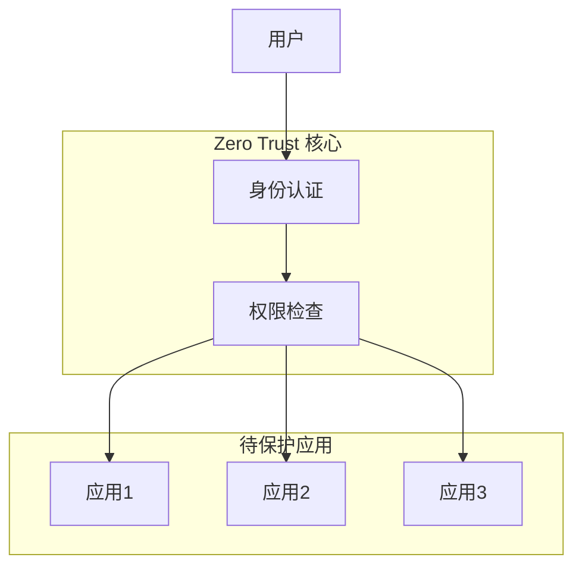

说到企业网络安全，VPN 绝对是大多数人的第一反应。我刚入行那会儿，每次访问公司内部系统，都得先伺候好那个让人又爱又恨的 VPN 客户端——连不上它，啥都干不了。但最近审计一个跑在 Supabase 上的内部应用时，我彻底被逼着重新思考：在云服务满天飞的今天，老一套 VPN 防护还罩得住吗？

## VPN：熟悉的"看门大叔"

VPN 像极了我们小区的门卫大爷——输对密码就能进"安全区"，进去后基本畅通无阻。这模式过去挺管用，尤其当所有东西都锁在公司机房的时候。

但用久了真能憋出内伤。记得有次出差，我兴冲冲掏出 iPad 想改个紧急方案，结果发现装不了公司 VPN。盯着邮件里那个诱人的内网链接，手指都快戳穿屏幕了也点不开。更崩溃的是网络体验：所有流量都得绕道 VPN 服务器，视频会议卡成连环画，同事说话时嘴巴动得比字幕还慢。

最要命的是安全隐患——去年隔壁组同事 VPN 账号被盗，黑客就像拿了万能门禁卡，在内网逛超市似的随便拿数据。典型的"外严内松"：大门铜墙铁壁，后院篱笆扎得跟玩儿似的。

## Zero Trust：全员"疑心病"的安全观

Zero Trust（零信任）名字听着高大上，核心就一句话：**管你是谁，想进门都得验明正身**。

在 Bybit 用 Akamai EAA 的经历让我开了眼——不用装任何客户端，浏览器输个内网地址，自动跳转到登录页。认证完直接进系统，顺滑得跟微信扫码登录小程序似的。这才是现代打工人要的体验嘛！

打个比方：传统 VPN 像老式小区，进门就能瞎晃；Zero Trust 则是高端实验室，进每间房都得刷卡验指纹。

## 真实战场：云时代的防护困局

最近遇到的 Supabase 内网应用特别典型——审计时发现漏洞跟马蜂窝似的，想用 IP 白名单？没门！这种云服务根本不支持。VPN 在这儿完全抓瞎。

现在全是这类头疼场景：
- SaaS 服务压根不认 IP 白名单
- 员工设备五花八门（手机/平板/游戏本齐上阵）
- 远程办公成家常便饭  
- 应用分散在 AWS/GCP/阿里云

Zero Trust 这时就显神通了——管你应用躲哪个云里，只要挂上统一认证，访问控制照样搞定。相当于给每个应用装了智能门禁，权限精准到人。

## Zero Trust 三板斧（说人话版）

**1. 身份认证**  
相当于电子工牌系统，确认你是谁。能用公司现有的 AD/LDAP，也能接 Azure AD 这些新玩家。

**2. 策略引擎**  
像保安室的监控大屏，实时判断："小张能用笔记本访问财务系统吗？凌晨三点行不行？从泰国连过来允不允许？"

**3. 访问网关**  
就是那个较真的门卫，每个请求都查证件、对名单、记日志。Cloudflare Zero Trust 和 Akamai EAA 本质都是把这套做成开箱即用的服务。

## 终极对决：怎么选？

| 比较项       | 传统 VPN          | Zero Trust         |
|--------------|-------------------|--------------------| 
| **安全逻辑** | 进门就放羊        | 步步设卡           |
| **使用体验** | 装客户端+绕路减速 | 浏览器直连如德芙   |
| **设备支持** | 挑食（要客户端）  | 不挑食（有网就行） |
| **管理难度** | 简单但僵化        | 前期费劲后期灵活   |
| **最佳场景** | 老旧内网系统      | 云应用/混合架构    |

## 学习曲线：实话实说

摸着良心说，Zero Trust 上手确实要脱层皮。第一次看到 OIDC、SAML、RBAC 这些术语时，我差点以为在考英语六级。很多公司观望就因为这——VPN 再难用，至少是老朋友啊！

但话说回来，这些技术现在遍地都是，早学晚学躲不掉。而且现代方案配置界面越来越友好，就像组装宜家家具——按说明书操作就行，不用先当木匠学徒。

## 写在最后

Zero Trust 和 VPN 不是取代关系，更像是安全体系的版本升级。传统系统用 VPN 没毛病，但面对云原生和远程办公这种副本，Zero Trust 明显更扛打。

选哪种得看具体战场。像我遇到的 Supabase 防护难题，Zero Trust 就是最佳答案。安全没有万能药，但多备几种解决方案，遇到问题才能淡定掏工具。

说到底，安全不是给业务戴枷锁，而是让跑得更稳更远。选对架构，创新才有底气撒丫子狂奔。