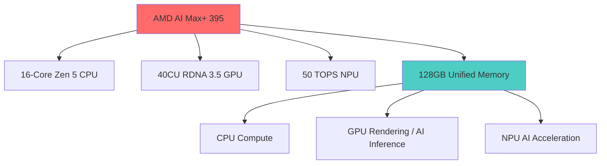
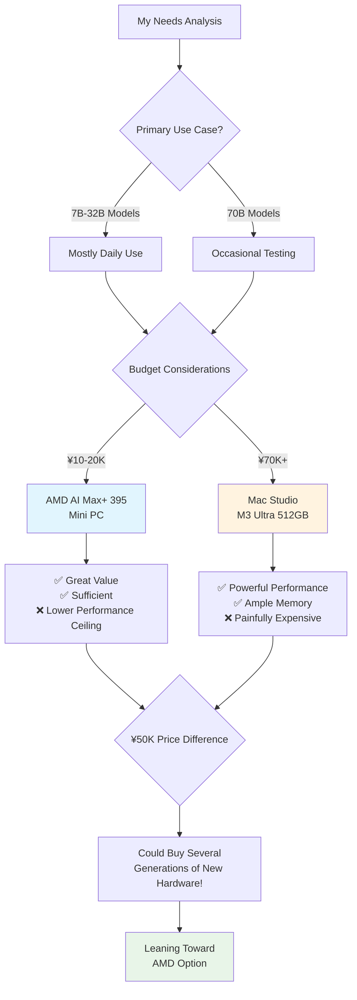

A few days ago, while scrolling through Twitter, I stumbled upon someone sharing AMD's new AI Max+ 395 chip. Apparently it supports up to 128GB of memory, and several mini PC manufacturers have already shipped products based on it. As someone who regularly tinkers with local LLM inference, this immediately caught my attention. With today's large language models routinely requiring tens or even hundreds of gigabytes, memory has always been the painful bottleneck.

## A First Taste of Unified Memory Architecture on PC

When you hear "unified memory architecture," Apple's M-series chips probably come to mind first. Since the M1, Apple has been touting the advantages of having the CPU and GPU share a single memory pool — no more shuttling data back and forth. Having used an M1 MacBook myself, I can confirm the smoothness and battery life gains are real.

What I didn't expect was AMD pulling the same move with the AI Max+ 395. This chip packs 16 Zen 5 CPU cores, 40 RDNA 3.5 GPU compute units, and a 50 TOPS XDNA 2 NPU. But the real showstopper? It supports up to 128GB of quad-channel LPDDR5X-8000 memory, with a whopping 96GB available as VRAM.

This reminds me of my days running an AMD R3900 desktop. AMD's multi-core performance has always been solid, but back then you still needed a discrete GPU. And AMD's high-performance APU lineup was always pretty conservative — mostly entry-level stuff. It looks like they've finally figured out the high-end APU game.

## The Golden Age of Mini PCs

I went on a shopping spree (window shopping, at least) and found several manufacturers already shipping AI Max+ 395-based mini PCs. Here are the standouts:

### GMKtec EVO-X2
- Price: Around ¥14,999 (~$2,050 USD)
- Memory: 64GB or 128GB LPDDR5X-8000 options
- Storage: 1TB or 2TB PCIe 4.0 SSD
- Marketing claim: "World's first Windows 11 AI+ PC capable of running 70B models" — sounds impressive

### Beelink GTR9 Pro
- Price: Around ¥12,999 (~$1,799 USD)
- Memory: Maxed out at 128GB
- Marketing claim: Can run DeepSeek 70B locally
- AI performance: 126 TOPS — a compelling number

### Minisforum MS-S1 MAX
- TDP: Supports 160W (more headroom than competitors' 120-140W)
- Form factor: 2U rackmount design with PCIe x16 expansion slot — solid expandability
- Connectivity: Among the first devices worldwide to support USB4 V2 (80Gbps)

## The Value Showdown Against Mac Studio

When it comes to local LLM inference, Apple's Mac Studio is the elephant in the room. The top-spec M3 Ultra version can be configured with up to 512GB of unified memory, making it a beast for running the largest models.

But then you look at the price, and your wallet starts weeping. A 512GB Mac Studio M3 Ultra runs over ¥70,000. Compare that to an AMD AI Max+ 395 mini PC at ¥10,000-20,000, and the price gap is staggering.

Let's break it down:

**Mac Studio M3 Ultra strengths:**
- Absurdly large memory ceiling (up to 512GB)
- Mature ecosystem with deep optimizations
- Best-in-class power efficiency (under 200W running DeepSeek R1)
- 800GB/s memory bandwidth — blazing fast

**AMD AI Max+ 395 strengths:**
- Unbeatable price-to-performance ratio
- Better Windows ecosystem compatibility
- More upgrade flexibility (some models allow user-replaceable memory and storage)
- Crushes Intel's offerings in AI workloads (up to 12x faster on certain models!)

## What the Community Is Saying

I spent some time lurking on Reddit and V2EX to see what people actually think. The discussions tend to cluster around a few themes:

**The enthusiastic crowd:**
- "Finally, I can run 70B models locally without selling a kidney!"
- "This is the first time unified memory architecture has shipped at scale on PC — AMD is killing it!"
- "Compared to paying for cloud API inference, local deployment is both more private and cheaper. No-brainer."

**The skeptics:**
- "What's the actual inference speed with real-world models?"
- "Can the thermals and power delivery really handle sustained loads?"
- "Will the software ecosystem keep up?"

On the Level1Techs forum, one user shared their experience with the GMKtec EVO-X2, reporting that they tested various LLMs using LM Studio and Ollama and were quite satisfied with the performance.

## A New Era for Local AI Inference

From a technology perspective, the AMD AI Max+ 395 is genuinely a milestone. It proves that unified memory architecture isn't Apple's exclusive domain — the PC ecosystem can deliver equally impressive results.

For those of us running local LLM inference, this is fantastic news. While it may not match the absolute peak performance or memory capacity of a maxed-out Mac Studio, the value proposition and practicality are compelling enough.

This is especially significant for small businesses and individual developers. Spending ¥10,000-20,000 to deploy 70B models locally was unthinkable just a short while ago. No data privacy concerns, no agonizing over API token costs, and excellent performance for long-context workloads.

## My Decision Dilemma

The choice in front of me is genuinely difficult:

1. **AMD AI Max+ 395 Mini PC**: ¥10,000-20,000, incredible value, but a lower performance ceiling
2. **Mac Studio M3 Ultra 512GB**: Unmatched performance, but that ¥70,000+ price tag stings

After thinking it through, my daily workload mostly involves 7B to 32B models, with 70B being an occasional experiment. The AMD option should more than cover my needs. And that ¥50,000+ I'd save? That's enough to upgrade hardware for several generations.

Looking back at my experience with the Mac M1 and AMD R3900, AMD's performance has always been rock-solid, and their power efficiency has improved considerably. If the AI Max+ 395 strikes the right balance between performance and thermals, it'll be a no-brainer.

## Final Thoughts

Technology keeps surprising us. A few years ago, who would have imagined casually running models with tens of billions of parameters on a desktop? The AMD AI Max+ 395 has truly brought local AI inference to the masses.

It may not be the absolute performance champion, but at this point in time, it's a godsend for anyone who values bang for their buck. The true measure of technology isn't just pushing boundaries — it's making the benefits of progress accessible to everyone.

As for my final decision? I'll probably wait a bit longer to see real-world user feedback and how the software ecosystem develops. After all, buying hardware isn't just about specs — the overall experience is what matters most.

---

*What are your thoughts on local LLM inference? Or do you have experience with AMD AI Max+ 395-based products to share? Feel free to discuss in the comments.*
