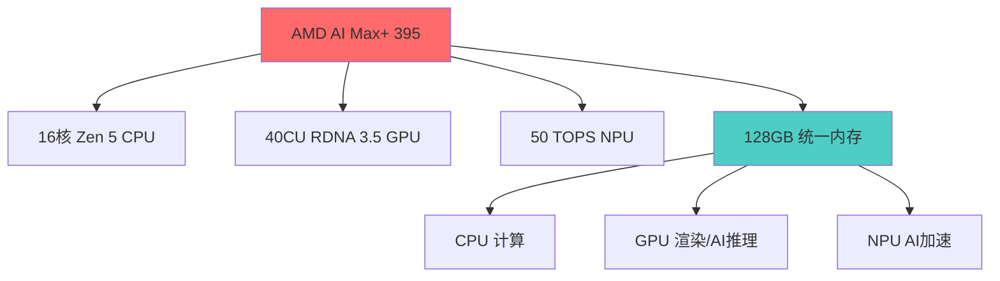
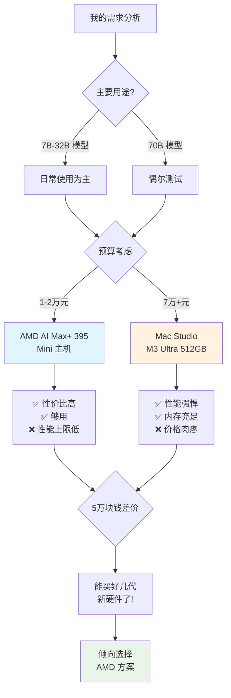

前几天逛 Twitter 的时候，偶然刷到有人分享 AMD 新推出的 AI Max+ 395 芯片，据说支持高达 128GB 的内存，而且已经有好几家 Mini 主机厂商推出了相关产品。作为一个经常折腾本地大模型推理的人，这个消息瞬间让我眼前一亮。要知道，现在的大模型动辄几十GB甚至上百GB，内存一直是个让人头疼的瓶颈啊！

## 统一内存架构的 PC 初体验

一提到统一内存架构，我脑子里立马蹦出苹果的 M 系列芯片。从 M1 开始，苹果就把统一内存架构的优势吹得天花乱坠——CPU 和 GPU 共享同一个内存池，省去了数据来回搬运的麻烦。我之前用过 M1 的 MacBook，确实能感受到这种设计带来的流畅体验和续航提升。

没想到啊，AMD 这次在 AI Max+ 395 上也玩起了同样的套路。这颗芯片集成了 16 个 Zen 5 CPU 核心、40 个 RDNA 3.5 GPU 计算单元，还塞进了一个 50 TOPS 算力的 XDNA 2 NPU。最让我心动的是，它居然支持高达 128GB 的 LPDDR5X-8000 四通道内存，而且其中足足 96GB 都能当显存用！

这让我不禁想起之前用 AMD r3900 台式机的日子。AMD 的多核性能确实给力，不过那时候还得单独配显卡。而 AMD 在高性能 APU 这块一直比较保守，大多数产品都偏向入门级。现在看来，AMD 在高端 APU 这条路上总算是开窍了。

## Mini 主机的春天来了

我特意去市面上转了一圈，发现已经有好几家厂商推出了基于 AI Max+ 395 的 Mini 主机，挑几个有代表性的说说：

### GMKtec EVO-X2
- 价格：大概 14,999 元人民币（折合 2,050 美元左右）
- 内存：可选 64GB 或 128GB 的 LPDDR5X-8000
- 存储：1TB 或 2TB 的 PCIe 4.0 SSD
- 特色：号称是"全球首款支持 70B 大模型的 Windows 11 AI+ PC"，听起来挺唬人

### Beelink GTR9 Pro
- 价格：约 12,999 元（约 1,799 美元）
- 内存：直接给你怼满 128GB
- 特色：宣传说能本地运行 DeepSeek 70B 模型
- AI 性能：126 TOPS，这数字看着就带劲

### Minisforum MS-S1 MAX
- 功耗：支持 160W TDP（比别家的 120-140W 更猛）
- 特色：2U 机架式设计，还支持 PCIe x16 扩展槽，扩展性不错
- 连接：全球首批支持 USB4 V2（80Gbps）的设备，传数据嗖嗖的

## 与 Mac Studio 的性价比较量

聊到本地大模型推理，苹果的 Mac Studio 绝对是个绕不开的话题。尤其是顶配的 M3 Ultra 版本，能堆到 512GB 的统一内存，对付那些超大规模模型简直是小菜一碟。

不过一看价格，我的小心脏就受不了了——一台 512GB 内存的 Mac Studio M3 Ultra 要价 7 万多人民币！再看看 AMD AI Max+ 395 的 Mini 主机，只要 1 到 2 万块，这价格差距简直让人感动到流泪。

咱们来实际比比看：

**Mac Studio M3 Ultra 的优势：**
- 内存大到离谱（最高 512GB）
- 生态成熟，优化到位
- 功耗控制一流（跑 DeepSeek R1 模型时功耗还不到 200W）
- 800GB/s 的内存带宽，速度飞起

**AMD AI Max+ 395 的优势：**
- 性价比高到没朋友
- 对 Windows 生态兼容性更好
- 升级空间更灵活（有些机型还能自己加内存和硬盘）
- 跟 Intel 的方案比，AI 性能简直是碾压（某些模型上能快 12 倍！）

## 社区的真实声音

我特地跑到 Reddit 和 V2EX 这些技术社区潜水，发现大伙儿对这块芯片的讨论主要集中在这么几点：

**叫好声一片：**
- "终于不用砸锅卖铁就能本地跑 70B 模型了！"
- "统一内存架构第一次在 PC 上大规模落地，AMD 牛啊！"
- "跟云端 API 推理比，本地部署既安全又省钱，真香！"

**也有不少人在担心：**
- "实际跑大模型的时候速度到底咋样？"
- "这功耗和散热压得住吗？"
- "软件生态跟不跟得上啊？"

在 Level1Techs 论坛上，一位老哥分享了他入手 GMKtec EVO-X2 的体验，说用 LM Studio 和 Ollama 测试了各种大模型，跑得都挺溜，效果相当满意。

## 本地 AI 推理的新时代

从技术发展的角度来看，AMD AI Max+ 395 的横空出世确实是个里程碑。它证明了统一内存架构可不是苹果的专利，PC 阵营也能搞出同样惊艳的产品。

对我们这些玩本地大模型推理的人来说，这简直是个天大的好消息。虽说在极限性能和内存容量上可能还干不过顶配的 Mac Studio，但论性价比和实用性，它已经足够让人心动了。

特别是中小企业和个人开发者，只要花个 1 到 2 万块就能在本地部署 70B 的大模型，放在以前想都不敢想啊！既不用担心数据隐私问题，又不用肉疼 API token 的费用，处理长文本之类的场景简直不要太爽。

## 我的选择纠结

现在摆在面前的选择，说实话挺让人纠结的：

1. **AMD AI Max+ 395 Mini 主机**：1-2 万块就能拿下，性价比没得说，但性能上限确实低一些
2. **Mac Studio M3 Ultra 512GB**：性能强到没边，但 7 万多的价格真心肉疼

琢磨了一下，我平时主要跑的是 7B 到 32B 的模型，70B 的也就是偶尔玩玩，AMD 的方案应该够我折腾了。再说了，省下来的那 5 万多块钱，都够我升级好几代硬件了！

想想之前用 Mac M1 和 AMD r3900 的经历，AMD 的性能一直稳如老狗，功耗控制也做得不错。要是这次的 AI Max+ 395 能在性能和功耗之间拿捏到位，那绝对是个真香选择。

## 写在最后

技术发展这事儿，总是能给人惊喜。搁几年前，谁敢想象咱们能在桌面上轻松跑几十GB 参数的大模型？AMD AI Max+ 395 的出现，让本地 AI 推理彻底飞入了寻常百姓家。

虽说它可能不是性能最强的，但眼下这个时间点，对追求性价比的朋友来说绝对是个福音。技术的价值不光在于突破极限，更在于让每个普通人都能享受到科技进步的红利。

至于我最后会选哪个方案？可能还得再观望一阵子，看看实际用户反馈和软件生态的进展。毕竟买硬件不能光看参数，整体的使用体验才是王道啊。

---

*你对本地大模型推理有什么看法？或者有使用 AMD AI Max+ 395 相关产品的经验分享？欢迎在评论区交流讨论。*