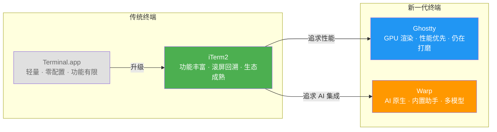

If you're like me and your daily development workflow already depends on AI coding agents like Claude Code and Codex, you've probably wondered: **does the terminal itself affect the AI experience?**

I used iTerm2 for years, then switched to Ghostty last year after hearing it played nicer with AI tools. I've also been using Warp for certain scenarios. Recently I had some time to put all of them side by side for a proper comparison — and I dragged the built-in Terminal.app along for the ride.

## TL;DR: There's No Perfect Answer

Let me just say it upfront: **no single terminal is the "optimal choice" for AI coding.** Each has its strengths and pain points, and the best pick depends on your habits and specific use case. Here's a rough positioning of the four:

## Terminal.app: It Works, But Don't Push It

macOS's built-in Terminal.app is like the Notes app on your phone — technically capable of everything, but not something you'd use for serious work.

The biggest dealbreaker is **no Shift+Enter support**. When running Claude Code, multi-line input is essential, but Terminal.app can't distinguish Shift+Enter from Enter due to underlying [VT terminal protocol limitations](https://blog.fsck.com/releases/2026/02/26/terminal-keyboard-protocol/) (a gap that dates back to 1978). You can work around it with Option+Enter, but that requires manual keyboard configuration. On top of that, there are no desktop notifications, emoji rendering has character overlap issues, and TUI rendering is rough. The official Claude Code [terminal setup guide](https://docs.anthropic.com/en/docs/claude-code/terminal-setup) also acknowledges these limitations.

**Bottom line: Fine for occasional use. Not recommended as your daily driver for AI agents.**

## iTerm2: The Veteran's Edge

iTerm2 is the terminal I've used the longest, and I'll admit there's some sentimental attachment. For AI coding specifically, it has one killer feature that nobody else offers: **alternate screen scrollback**.

Here's what that means. Claude Code takes over the entire terminal screen when it runs (alternate screen mode). Most terminals don't let you scroll back through history in this mode. But iTerm2 has a "Save lines to scrollback in alternate screen mode" option. Enable it, and you can scroll up through previous AI output at any time. When a long conversation produces hundreds of lines of code changes, this feature is a lifesaver.

That said, I have to be honest — **I did experience terminal lag and scroll flickering when running Claude Code on iTerm2 before.** Especially when the AI was dumping large blocks of output, there would be noticeable delays. I'm not sure whether iTerm2 fixed this or Claude Code optimized on their end, but going back to test it now, things are noticeably better than before.

iTerm2 also has a **split panes** advantage. One of my go-to workflows is running Claude Code on the left generating code while Codex reviews on the right. iTerm2's split panes combined with tmux work beautifully. If you want to try this kind of [parallel workflow](https://iterm2.com/documentation-tmux-integration.html), iTerm2's tmux integration is currently the best in class.

**Best for: Users who prefer traditional terminal workflows, need robust scrollback, and do multi-window parallel development.**

## Ghostty: Performance Beast, Still Being Polished

I switched to Ghostty after hearing it was better adapted for AI tools. After several months of use, here's the honest take: **the performance advantage isn't particularly noticeable in day-to-day use.** Ghostty's official claim is [2ms key-to-screen latency](https://ghostty.org/docs/about) (vs. ~12ms for iTerm2), but human eyes simply can't tell the difference.

What actually sold me on Ghostty is that the **lag and scroll flickering I experienced on iTerm2 never occurred on Ghostty.** Whether that's because Ghostty's GPU rendering (Metal-based) is genuinely more robust, or because I happened to benefit from Claude Code's own optimizations, the experience does feel smoother.

But there's one issue I have to flag: **when doing SSH remote development, if the session disconnects and reconnects, the terminal enters a broken state** — mouse clicks produce garbage characters, and you have to run `reset` to recover. This is pretty annoying when running AI agents on remote machines for extended periods.

Also worth noting: Ghostty had a [severe memory leak issue](https://github.com/ghostty-org/ghostty/issues/10289) reported previously — opening multiple Claude Code windows could cause memory usage to balloon past 70GB. The good news is this was fixed in [v1.3](https://ghostty.org/docs/install/release-notes/1-3-0), so if you're on an older version, update immediately.

Ghostty also has some known compatibility quirks, such as [Ctrl+A/E readline shortcuts](https://github.com/anthropics/claude-code/issues/32087) not working in Claude Code (because Ghostty uses the Kitty keyboard protocol), and the [numpad Enter key](https://github.com/anthropics/claude-code/issues/18480) producing strange characters. But these are the kind of things you learn to work around after encountering them once.

**Best for: Users who want smooth rendering, can't stand terminal lag, and don't mind the occasional rough edge.**

## Warp: AI-Native, But a Bit Awkward for AI Agents

Warp is the most distinctive of the four — it's not a traditional terminal with AI bolted on; it was **designed from the ground up with AI as a first-class priority.** The built-in AI assistant is genuinely useful, especially when you can't remember command flags. Just describe what you want in natural language — way faster than digging through man pages.

But one thing that puzzles me: **the transition between Warp's own AI agent mode and normal command mode isn't particularly smooth.** When you're in the middle of an AI conversation in Warp and want to switch back to normal terminal operation, or vice versa, there's always a brief moment of confusion — who exactly am I talking to right now?

Running Claude Code in Warp also has compatibility issues. Warp's block-based UI and Claude Code's TUI occasionally conflict: community members have reported that long, high-load sessions cause [Warp to completely freeze](https://github.com/warpdotdev/Warp/issues/8805), and some have even hit [Rust-level crashes](https://github.com/warpdotdev/Warp/issues/8756). On the positive side, Warp offers an [official Claude Code integration package](https://github.com/warpdotdev/claude-code-warp), showing they're actively working on these problems.

**Best for: Users who frequently need AI help recalling command syntax and want an "out-of-the-box" AI experience. Not ideal for heavy, sustained Claude Code usage.**

## Comparison at a Glance

| Dimension | Terminal.app | iTerm2 | Ghostty | Warp |
|-----------|-------------|--------|---------|------|
| Shift+Enter | Not supported | Native support | Native support | [Requires config](https://github.com/warpdotdev/Warp/issues/6401) |
| Desktop Notifications | Not supported | Manual setup needed | Native support | Supported |
| Emoji Rendering | Overlap issues | Excellent | Best (Unicode 17) | Good |
| Long AI Session Stability | Fair | Occasional lag | Stable | [Occasional freezes](https://github.com/warpdotdev/Warp/issues/8805) |
| Built-in AI | None | [Optional plugin](https://iterm2.com/ai-plugin.html) | None | Rich (Oz multi-model) |
| Scrollback in Alt Screen | Not supported | Supported (unique advantage) | Not supported | Per-block viewing |
| Open Source | No | Yes | Yes | No (login required) |

## My Setup

Right now I'm running **Ghostty as my primary terminal, with Warp as a secondary.** Daily Claude Code and Codex sessions go through Ghostty — stable and fast. When I occasionally need AI help with complex system commands, I switch to Warp where the built-in AI assistant is more convenient.

But that's just my workflow. If you value being able to scroll back through AI output history, iTerm2 might suit you better. If you just want to install a terminal and start working without any configuration, Warp's out-of-the-box experience is genuinely the best.

Terminals are like the editor wars — **the one that feels right is the right one.** Picking a terminal that makes communication between you and your AI agent as smooth as possible matters more than obsessing over benchmarks. If you've had a different experience or found a better combination, I'd love to hear about it in the comments.

> This article is based on the latest versions of each terminal as of April 2026. Terminal apps update frequently, and some issues mentioned may already be fixed in newer releases. If you're also tuning your AI coding workflow, you might want to check out my earlier post [From One Week to Half a Day: A Deep Dive into AI Programming Workflows](/tech-sharing/ai-programming/2025/09/05/ai-programming-workflow.html).
