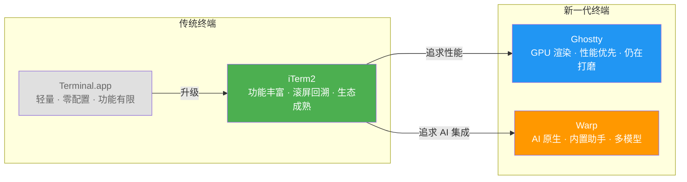

如果你和我一样，日常开发已经离不开 Claude Code 和 Codex 这类 AI 编码 Agent，那你大概也思考过一个问题：**终端本身会不会影响 AI 的使用体验？**

我用了好几年 iTerm2，去年听说 Ghostty 对 AI 工具适配更好，就切了过去。同时因为一些特定场景，Warp 也一直在用。最近正好有空，把这几个终端放在一起做了个体验对比，顺便也把系统自带的 Terminal.app 拉出来遛了一圈。

## 先说结论：没有完美答案

直接说吧，**没有哪个终端是 AI 编码的"最优解"**。它们各有各的优势和坑点，选哪个更多取决于你的使用习惯和具体场景。下面这张图大致概括了四款终端的定位：

## Terminal.app：能用，但别折腾

macOS 自带的 Terminal.app，怎么说呢，就像手机自带的备忘录 — 功能上啥都有，但你不会拿它干正事。

最大的硬伤是 **Shift+Enter 不支持**。跑 Claude Code 的时候，多行输入是刚需，而 Terminal.app 因为底层的 [VT 终端协议限制](https://blog.fsck.com/releases/2026/02/26/terminal-keyboard-protocol/)（这个坑从 1978 年就留下来了），压根分不清 Shift+Enter 和 Enter。虽然可以用 Option+Enter 绕过，但得手动改键盘设置。另外，桌面通知也没有，Emoji 渲染还会出现字符重叠，TUI 界面的绘制效果也比较粗糙。Claude Code 官方的[终端配置指南](https://docs.anthropic.com/en/docs/claude-code/terminal-setup)也提到了这些限制。

**一句话：如果你只是临时用一下，没问题。日常拿来跑 AI Agent，不推荐。**

## iTerm2：老牌选手的底蕴

iTerm2 是我用了最久的终端，说实话有感情了。在 AI 编码这个场景下，它有一个别家都没有的杀手级功能：**alternate screen scrollback**。

什么意思呢？Claude Code 运行时会接管整个终端屏幕（alternate screen mode），大部分终端在这个模式下是不能回滚看历史输出的。但 iTerm2 有个 "Save lines to scrollback in alternate screen mode" 选项，打开之后你可以随时往上翻看之前的 AI 输出。当一个长对话产生了几百行代码变更，这个功能简直救命。

不过我得说实话，**之前用 iTerm2 跑 Claude Code 确实遇到过终端卡顿和滚屏闪烁的问题**。尤其是 AI 疯狂输出大段内容的时候，偶尔会出现明显的延迟。这个问题后来不确定是 iTerm2 修了还是 Claude Code 那边优化了，总之现在回去试了一下，比以前好了不少。

iTerm2 还有个优势是 **分屏**。我的一个常用工作流是：左边跑 Claude Code 生成代码，右边开 Codex 做审查，iTerm2 的 split panes 配合 tmux 用起来很顺。如果你也想试试这种[并行工作流](https://iterm2.com/documentation-tmux-integration.html)，iTerm2 的 tmux 集成是目前做得最好的。

**适合人群：习惯传统终端操作、需要丰富的滚屏回溯能力、多窗口并行开发的用户。**

## Ghostty：性能怪兽，但仍在打磨

切到 Ghostty 的初衷是听说它对 AI 工具适配更好。用了几个月，说实话，**性能优势在日常使用中感知不太明显**。Ghostty 官方标称按键到屏幕只要 [2ms 延迟](https://ghostty.org/docs/about)（iTerm2 约 12ms），但人眼根本分辨不出来。

真正让我对 Ghostty 满意的点是：iTerm2 上之前遇到的 **卡顿和滚屏闪烁在 Ghostty 上完全没有出现过**。不知道是 Ghostty 的 GPU 渲染（基于 Metal）确实更扎实，还是赶上了 Claude Code 自身的优化，反正体验上确实更顺滑了一些。

但 Ghostty 有个坑我必须说一下：**SSH 远程开发时，如果会话断开再恢复，终端会进入异常状态** — 鼠标点击会产生一堆乱码字符，必须执行 `reset` 命令才能恢复正常。这个在长时间远程跑 AI Agent 的场景下挺烦人的。

另外值得注意的是，Ghostty 之前被报过一个[严重的内存泄漏问题](https://github.com/ghostty-org/ghostty/issues/10289) — 多开几个 Claude Code 窗口可能导致内存飙到 70 多 GB。好消息是这个 bug 在 [v1.3 已经修复](https://ghostty.org/docs/install/release-notes/1-3-0)了，如果你还在用旧版本，赶紧更新。

Ghostty 还有一些已知的兼容性问题，比如 [Ctrl+A/E 等 readline 快捷键](https://github.com/anthropics/claude-code/issues/32087)在 Claude Code 里可能失灵（因为 Ghostty 使用了 Kitty 键盘协议），[小键盘回车键](https://github.com/anthropics/claude-code/issues/18480)会输出奇怪字符等。不过这些坑踩一次知道怎么绕就好了。

**适合人群：追求流畅渲染体验、受不了终端卡顿、不介意偶尔踩坑的用户。**

## Warp：AI 原生，但 AI Agent 场景有些拧巴

Warp 是四个里面最特别的 — 它不是一个传统终端加了 AI 功能，而是 **从头就按 AI 优先的思路设计的**。内置的 AI 助手确实好用，特别是记不住命令参数的时候，直接用自然语言描述就行，比去翻 man page 快得多。

但一个让我困惑的地方是：**Warp 自己的 AI Agent 模式和普通命令模式之间的切换体验不太清晰**。你在用 Warp 的内置 AI 对话时，突然想切回正常终端操作，或者反过来，这个切换过程总让人有一瞬间的迷惑 — 我现在到底在跟谁说话？

用 Warp 跑 Claude Code 也有些兼容性问题。Warp 的 block-based UI 和 Claude Code 的 TUI 界面之间偶尔会打架：有社区用户反馈长时间高负载会话导致 [Warp 直接卡死](https://github.com/warpdotdev/Warp/issues/8805)，甚至触发 [Rust 层面的 crash](https://github.com/warpdotdev/Warp/issues/8756)。不过 Warp 也提供了[官方的 Claude Code 集成包](https://github.com/warpdotdev/claude-code-warp)，说明他们在认真解决这些问题。

**适合人群：经常需要 AI 帮忙回忆命令用法、喜欢"开箱即用"AI 体验的用户。不太适合把 Claude Code 当主力工具深度使用的场景。**

## 对比一览

| 维度 | Terminal.app | iTerm2 | Ghostty | Warp |
|------|-------------|--------|---------|------|
| Shift+Enter | 不支持 | 原生支持 | 原生支持 | [需配置](https://github.com/warpdotdev/Warp/issues/6401) |
| 桌面通知 | 不支持 | 需手动开启 | 原生支持 | 支持 |
| Emoji 渲染 | 有重叠问题 | 优秀 | 最佳（Unicode 17） | 良好 |
| AI 长会话稳定性 | 一般 | 偶有卡顿 | 稳定 | [偶有卡死](https://github.com/warpdotdev/Warp/issues/8805) |
| 内置 AI 能力 | 无 | [可选插件](https://iterm2.com/ai-plugin.html) | 无 | 丰富（Oz 多模型） |
| 滚屏回溯 | 不支持 | 支持（独有优势） | 不支持 | 按 block 查看 |
| 开源 | 否 | 是 | 是 | 否（需登录） |

## 我的选择

现在我的方案是 **Ghostty 为主，Warp 为辅**。日常跑 Claude Code 和 Codex 用 Ghostty，够稳够快；偶尔需要 AI 帮忙处理一些复杂的系统命令时，切到 Warp 用它的内置 AI 会更方便。

但这只是我的使用习惯。如果你特别看重滚屏回看 AI 输出历史，iTerm2 可能更适合你；如果你就想装个终端立刻干活不折腾，Warp 的开箱体验确实是最好的。

终端这东西，就像编辑器之争一样，**用着顺手的就是最好的**。选一个能让你和 AI Agent 之间沟通最顺畅的，比纠结参数指标重要得多。如果你有不同的体验或者发现了更好用的组合，欢迎在评论区聊聊。

> 本文基于 2026 年 4 月各终端最新版本的体验。终端应用更新很快，部分问题可能已在后续版本中修复。如果你也在折腾 AI 编码工作流，可以看看我之前写的[《从一周到半天：AI 编程工作流深度实践》](/tech-sharing/ai-programming/2025/09/05/ai-programming-workflow.html)。
